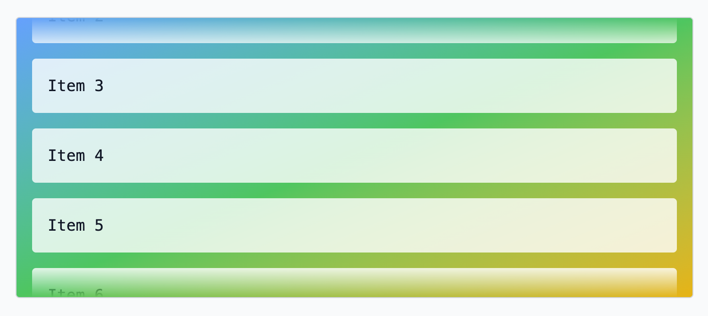

<div align="center">
  <br />
  
  <h1>svelte-overflow-fade</h1>
  <p>
    <strong>A Svelte action and attachment for adding beautiful fade effects to overflowing content</strong>
  </p>
</div>

<br />

<div align="center">
  
</div>

## 🖼️ Demo

[Live Demo →](https://harshmandan.github.io/svelte-overflow-fade/)

## ✨ Features

- 🎨 **Two fade modes**: CSS mask-based or DOM element-based
- 🔄 **Dual API support**: Actions for all Svelte versions, Attachments for Svelte 5.29+
- 📏 **Directional scrolling**: Supports both horizontal and vertical overflow
- 🎯 **Smart detection**: Automatically shows/hides fades based on scroll position
- ⚡ **Performant**: Throttled scroll events and optimized animations
- 🌗 **Dark mode ready**: Works seamlessly with any color scheme
- 📦 **Zero dependencies**: Lightweight and self-contained

## 📦 Installation

```bash
npm install svelte-overflow-fade
```

```bash
pnpm add svelte-overflow-fade
```

```bash
yarn add svelte-overflow-fade
```

## 🚀 Quick Start

### Using the Action API (All Svelte versions)

```svelte
<script>
	import { overflowFadeAction } from 'svelte-overflow-fade';
</script>

<div
	class="overflow-auto max-h-64"
	use:overflowFadeAction={{
		axis: 'y',
		fade: { type: 'mask', fadePercent: 10 }
	}}
>
	<!-- Your scrollable content -->
</div>
```

### Using the Attachment API (Svelte 5.29+)

```svelte
<script>
	import { overflowFade } from 'svelte-overflow-fade';
</script>

<div
	class="overflow-auto max-h-64"
	{@attach overflowFade({
		axis: 'y',
		fade: { type: 'mask', fadePercent: 10 }
	})}
>
	<!-- Your scrollable content -->
</div>
```

## ⚙️ Configuration Options

| Option                 | Type                  | Description                                   |
| ---------------------- | --------------------- | --------------------------------------------- |
| `axis`                 | `'x' \| 'y'`          | Direction of scroll (horizontal or vertical)  |
| `fade.type`            | `'mask' \| 'element'` | Fade implementation method                    |
| `fade.fadePercent`     | `number`              | Size of fade as percentage (mask mode only)   |
| `fade.size`            | `string`              | Size of fade in CSS units (element mode only) |
| `fade.backgroundColor` | `string`              | Fade color (element mode only)                |
| `fade.zIndex`          | `number`              | Z-index for fade elements (element mode only) |

## 🎨 Fade Modes

### CSS Mask Mode (Recommended)

- Uses CSS `mask-image` for smooth, native fading
- Perfect for gradient backgrounds
- Better performance
- Preserves background effects

```javascript
fade: {
  type: 'mask',
  fadePercent: 10
}
```

### Element Mode

- Creates DOM elements with gradient backgrounds
- Compatible with older browsers
- Customizable fade color
- Good for solid backgrounds

```javascript
fade: {
  type: 'element',
  size: '60px',
  backgroundColor: 'white',
  zIndex: 10
}
```

## 🔄 Events

The action dispatches an `overflow` event with the current overflow state:

```svelte
<script>
	function handleOverflow(event) {
		const { overflowTop, overflowBottom, overflowLeft, overflowRight } = event.detail;
		// React to overflow changes
	}
</script>

<div use:overflowFadeAction={{ axis: 'y' }} on:overflow={handleOverflow}>
	<!-- Content -->
</div>
```

## 📄 License

MIT © Harsh Mandan
